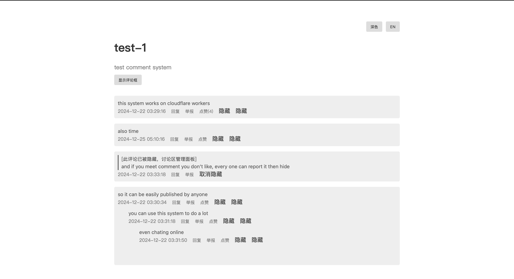
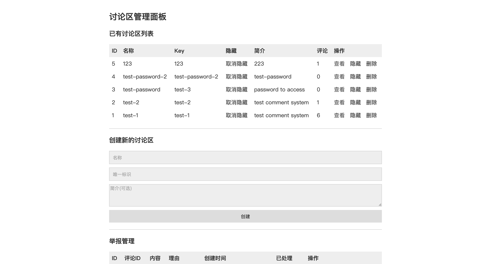
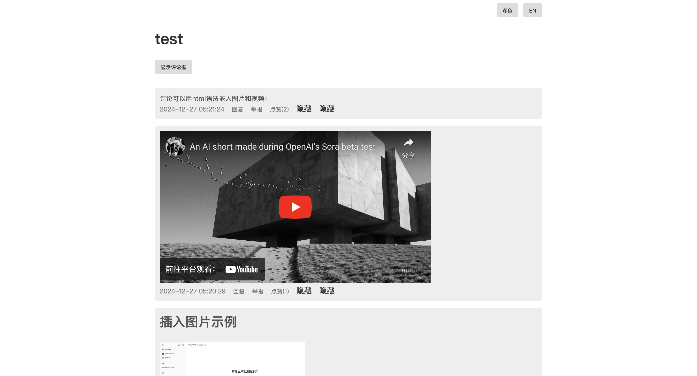

# Cloudflare Worker 评论系统

English(./readme.md)|简体中文(./readme-cn.md)

一个基于 Cloudflare Workers 运行的简单评论系统，支持 Markdown 语法、回复、点赞、举报，以及管理员后台管理功能。
Mixing版，更方便手机用户部署





## 特性

📝 Markdown 支持: 评论内容支持 Markdown 语法。

💬 回复功能: 支持对评论进行回复，形成讨论串。

👍 点赞功能: 用户可以点赞喜欢的评论。

🚩 举报功能: 用户可以举报不当评论。

🔒 管理后台: 管理员可以通过密码登录后台，管理评论区和举报。

⚙️ 主题切换: 支持浅色和深色主题切换。

🌐 多语言支持: 支持中文和英文切换。

🚀 Cloudflare Workers 驱动: 全球高速访问。

📱 嵌入式使用: 可以嵌入到任何网页。

✅ Turnstile 验证: 使用 Cloudflare Turnstile 验证用户提交。


## 逻辑
访问流程:
用户访问 → 检查 Cookie → 无 Cookie → 显示登录页面 → 验证密码 → 设置 Cookie → 进入管理页面
                          ↑
                      有 Cookie → 验证 Cookie → 进入管理页面

创建讨论区流程:
管理员登录 → 输入讨论区名称、唯一标识和简介(可选) → 创建新的讨论区

评论流程:
用户访问讨论区页面 → 显示评论列表 → 用户输入评论 → 验证 Turnstile → 保存评论 → 更新评论列表

管理流程:
管理员登录 → 管理讨论区列表、隐藏讨论区、删除讨论区、处理举报、隐藏评论


## 部署指南
### 前提条件

Cloudflare 账号

### 程序步骤

登录到cloudflare账号 [官网](https://dash.cloudflare.com/)

从侧边栏找到“workers和pages”选项并点击

点击新建，选择新建worker，随便取名

点击右上角编辑代码，先将页面放在一边，不要关闭

拷贝本项目[代码](/worker.js)

覆盖原有的代码（删除全部原有代码，并粘贴前一步复制的代码）

点击右上角部署


### 配套步骤

现在你是不能正确使用worker的，还需要完成以下必要的配置：


回到之前的“worker和page”页面，点击你刚才创建的程序

在上方选项中点击“设置”，找到“域和路由”

拷贝workers.dev的值，这是在不配置自定义域名情况下你评论系统的网址


#### TURNSTILE

在侧边栏中找到“Turnstile”

点击“添加小组件”，名称随意，点击“+添加主机名”

粘贴你复制的域名，点击输入框右侧的“添加”

下滑，勾选你刚才添加的主机名，点击“添加”

下滑点击“创建”

复制“站点密钥”内容


#### 环境变量

回到之前的“worker和page”页面，点击你刚才创建的程序

在上方选项中点击“设置”，下滑找到“变量和机密”

点击“添加”，变量名称填写“TURNSTILE_SITEKEY”，在“值”填写你复制的站点密钥

点击部署

点击“添加”，变量名称填写“ADMIN_PASS”，在“值”填写你想要的管理员密码（后期可更改）

点击部署


#### D1

在边栏选择“存储和数据库”，再选择“D1 SQL 数据库”

点击“创建”，创建 D1 数据库（名字随意）

点击“控制台”，在框内输入下方内容：
```
CREATE TABLE comment_areas (
 id INTEGER PRIMARY KEY AUTOINCREMENT,
 name TEXT NOT NULL,
 area_key TEXT NOT NULL UNIQUE,
 intro TEXT NULL,
 hidden INTEGER DEFAULT 0
);

CREATE TABLE comments (
 id INTEGER PRIMARY KEY AUTOINCREMENT,
 area_key TEXT NOT NULL,
 content TEXT NOT NULL,
 parent_id INTEGER DEFAULT 0,
 created_at DATETIME DEFAULT CURRENT_TIMESTAMP,
 hidden INTEGER DEFAULT 0,
 likes INTEGER DEFAULT 0,
 pinned INTEGER DEFAULT 0
);

CREATE TABLE reports (
 id INTEGER PRIMARY KEY AUTOINCREMENT,
 comment_id INTEGER NOT NULL,
 reason TEXT NOT NULL,
 created_at DATETIME DEFAULT CURRENT_TIMESTAMP,
 resolved INTEGER DEFAULT 0
);
```

回到之前的“worker和page”页面，点击你刚才创建的程序

在上方选项中点击“设置”，再次下滑找到“绑定”

点击“绑定”框右上角“添加+”，选择“D1数据库”

变量名称填写“DB”，下方勾选刚才创建的D1数据库


## 使用指南

### 管理员访问

1.  访问您的 Workers 域名。
2.  输入您设置的 `ADMIN_PASS` 密码登录。
3.  登录状态将保持 1 小时。

### 创建讨论区

1.  管理员登录后，在管理面板中，填写讨论区的名称、唯一标识 (area\_key) 和简介 (可选)。
2.  点击“创建”按钮，完成讨论区的创建。
3.  注意，讨论区的唯一标识 (area\_key) 创建后无法更改，用于在URL中标识不同的讨论区，请谨慎设置。

### 嵌入式使用

1.  使用 iframe 将评论系统嵌入到您的网页中。
2.  `iframe` 的 `src` 属性格式为 `https://your-worker.workers.dev/embed/area/[area_key]?theme=[light|dark]&lang=[zh-CN|en]`。
3.  请将 `your-worker.workers.dev` 替换为您的 Workers 域名，并替换`[area_key]` 为您创建的讨论区的唯一标识，并根据需要设置主题和语言。
4. 例如：`https://your-worker.workers.dev/embed/area/test-area?theme=dark&lang=zh-CN`

### 评论

1.  在讨论区页面，您可以在文本框中输入评论内容，内容支持 Html 语法。
2.  点击“提交评论”按钮，完成评论发布。
3.  评论发布后将无法删除。



### 回复

1.  在已有评论下方，点击“回复”按钮。
2.  在回复框中输入回复内容，并点击“提交评论”即可。

### 点赞

1.  在评论右侧，点击点赞按钮即可。

### 举报

1.  点击评论旁的 “举报” 按钮，输入举报理由并确认即可。

### 管理

1.  在管理页面，您可以管理所有的讨论区。
2.  您可以查看、隐藏和删除讨论区，以及处理举报信息，并隐藏被举报的评论。

## 技术细节

### 数据库结构

sql
```
CREATE TABLE comment_areas (
 id INTEGER PRIMARY KEY AUTOINCREMENT,
 name TEXT NOT NULL,
 area_key TEXT NOT NULL UNIQUE,
 intro TEXT NULL,
 hidden INTEGER DEFAULT 0
);

CREATE TABLE comments (
 id INTEGER PRIMARY KEY AUTOINCREMENT,
 area_key TEXT NOT NULL,
 content TEXT NOT NULL,
 parent_id INTEGER DEFAULT 0,
 created_at DATETIME DEFAULT CURRENT_TIMESTAMP,
 hidden INTEGER DEFAULT 0,
 likes INTEGER DEFAULT 0,
 pinned INTEGER DEFAULT 0
);

CREATE TABLE reports (
 id INTEGER PRIMARY KEY AUTOINCREMENT,
 comment_id INTEGER NOT NULL,
 reason TEXT NOT NULL,
 created_at DATETIME DEFAULT CURRENT_TIMESTAMP,
 resolved INTEGER DEFAULT 0
);
```

密码保护的管理员界面。

HttpOnly Cookie。

Cloudflare Turnstile 验证。

对评论内容进行 HTML 转义，防止 XSS 攻击。

配置选项
环境变量
变量名	描述	是否必须
ADMIN_PASS	管理员界面的登录密码	是
TURNSTILE_SITEKEY	Cloudflare Turnstile 站点密钥	是
TURNSTILE_SECRET_KEY	Cloudflare Turnstile 密钥	是
wrangler.toml 配置
name = "comment-system-worker"
main = "src/index.js"

[[d1_databases]]
binding = "DB"
database_name = "comment-system"
database_id = "your-database-id"
content_copy
download
Use code with caution.
Toml
开发指南
本地开发

克隆代码仓库后，运行:

wrangler dev
content_copy
download
Use code with caution.
Bash

访问 http://localhost:8787 进行测试。

代码结构
comment-system/
├── src/
│   └── index.js      # 主要入口文件
├── wrangler.toml     # Cloudflare 配置
└── migrations/       # D1 数据库迁移
    └── init.sql      # 数据库初始化的 SQL 文件

## 贡献指南

Fork 本仓库。

创建您的功能分支 (git checkout -b feature/AmazingFeature).

提交您的更改 (git commit -m 'Add some AmazingFeature').

推送分支 (git push origin feature/AmazingFeature).

创建一个 Pull Request.

致谢

Cloudflare Workers 平台

Gemini 2 flash Experimental

Chat-GPT-o1

反馈

如果您发现任何问题或者有任何改进建议，请创建一个 issue。
