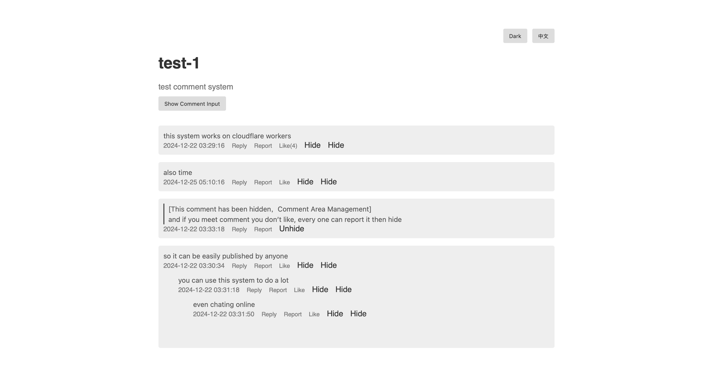
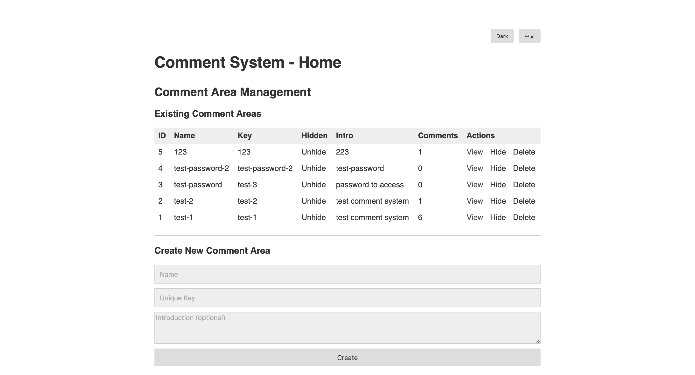
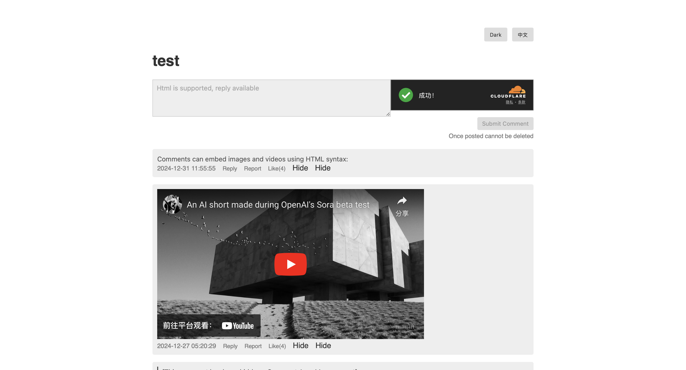

# Cloudflare Worker Comment System (Mixing Version)

一个基于 [Cloudflare Workers](https://workers.cloudflare.com/) 运行的简单评论系统，支持回复、点赞、举报以及管理员后台管理功能；同时提供中英双语切换，方便更广泛地使用。  
A simple comment system running on [Cloudflare Workers](https://workers.cloudflare.com/), supporting replies, likes, reports, and an admin management interface. It also provides bilingual (Chinese and English) support for broader usage.





---

## 目录 (Table of Contents)

1. [特性 | Features](#特性--features)  
2. [逻辑 | Workflow](#逻辑--workflow)  
3. [部署指南 | Deployment Guide](#部署指南--deployment-guide)  
    - [前提条件 | Prerequisites](#前提条件--prerequisites)  
    - [程序步骤 | Program Steps](#程序步骤--program-steps)  
    - [配套步骤 | Supporting Steps](#配套步骤--supporting-steps)  
    - [TURNSTILE 配置 | TURNSTILE Configuration](#turnstile-配置--turnstile-configuration)  
    - [环境变量 | Environment Variables](#环境变量--environment-variables)  
    - [D1 配置 | D1 Setup](#d1-配置--d1-setup)  
4. [使用指南 | Usage Guide](#使用指南--usage-guide)  
    - [管理员访问 | Admin Access](#管理员访问--admin-access)  
    - [创建讨论区 | Creating a Discussion Area](#创建讨论区--creating-a-discussion-area)  
    - [嵌入式使用 | Embedding the Comment System](#嵌入式使用--embedding-the-comment-system)  
    - [评论 | Commenting](#评论--commenting)  
    - [回复 | Replying](#回复--replying)  
    - [点赞 | Liking](#点赞--liking)  
    - [举报 | Reporting](#举报--reporting)  
    - [管理 | Management](#管理--management)  
5. [技术细节 | Technical Details](#技术细节--technical-details)  
6. [贡献指南 | Contributing](#贡献指南--contributing)  
7. [致谢 | Acknowledgments](#致谢--acknowledgments)  
8. [反馈 | Feedback](#反馈--feedback)  

---

## 特性 | Features

- **💬 回复功能 / Reply Functionality**  
  支持对评论进行回复，形成有层次的讨论串。  
  Supports replying to comments, forming discussion threads.

- **👍 点赞功能 / Like Functionality**  
  用户可以给喜欢的评论点赞。  
  Users can like comments they enjoy.

- **🚩 举报功能 / Report Functionality**  
  用户可以举报不当或违规评论。  
  Users can report inappropriate comments.

- **🔒 管理后台 / Admin Panel**  
  管理员可通过密码登录后台，管理评论、处理举报、隐藏/删除评论或讨论区。  
  Admins can log in with a password to manage comments, handle reports, hide/delete comments or discussion areas.

- **⚙️ 主题切换 / Theme Switching**  
  支持浅色和深色主题切换。  
  Supports switching between light and dark themes.

- **🌐 多语言支持 / Multilingual Support**  
  支持中英文双语切换。  
  Supports both Chinese and English languages.

- **🚀 Cloudflare Workers 驱动 / Powered by Cloudflare Workers**  
  依托 Cloudflare 全球网络提供快速访问。  
  Fast global access via Cloudflare’s worldwide network.

- **📱 嵌入式使用 / Embeddable**  
  可以轻松嵌入到任何网页或应用当中。  
  Easily embeddable into any webpage or app.

- **✅ Turnstile 验证 / Turnstile Verification**  
  使用 Cloudflare Turnstile 校验用户提交信息，防范垃圾评论。  
  Uses Cloudflare Turnstile to validate user submissions and combat spam.


---


## 部署指南 | Deployment Guide

以下步骤将指导你如何在 Cloudflare Workers 上快速部署本评论系统。  
The following steps will guide you through deploying this comment system on Cloudflare Workers.

### 前提条件 | Prerequisites

- 拥有 [Cloudflare 账号](https://dash.cloudflare.com/)  
  Have a [Cloudflare account](https://dash.cloudflare.com/)

### 程序步骤 | Program Steps

1. **登录 Cloudflare**: 访问 [Cloudflare 官方网站](https://dash.cloudflare.com/)，使用你的账号登录。  
   **Log in to Cloudflare**: Go to the [Cloudflare Dashboard](https://dash.cloudflare.com/) and log in.

2. **创建 Worker**: 在侧边栏找到 “Workers and Pages”，点击进入。  
   **Create a Worker**: In the sidebar, find **Workers and Pages** and click.

3. **新建 Worker**: 点击“创建”，选择“新建 Worker”，并随意命名。  
   **Set up Worker**: Click **Create**, select **Create Worker**, and name it as you like.

4. **编辑代码**: 在 Worker 详情页面的右上角点击 “编辑代码”，将此页面暂时放在一边。  
   **Edit Code**: Click **Edit Code** at the top right corner of the Worker details page.

5. **拷贝代码**: 从本项目中复制 [worker.js](/worker.js) 文件的全部内容。  
   **Copy Code**: Copy all contents of [worker.js](/worker.js) from this repository.

6. **覆盖 Worker 代码**: 删除默认的 Worker 代码后，将上述内容粘贴进去。  
   **Replace Worker Code**: Delete the default Worker code and paste the copied code.

7. **部署**: 点击右上角 “Deploy” 完成初步部署。  
   **Deploy**: Click **Deploy** on the top right to perform an initial deployment.

---

### 配套步骤 | Supporting Steps

由于还未配置必需的环境，默认状态下 Worker 无法正常工作，需要进一步配置。  
Your Worker will not function correctly yet without additional configurations.

1. **返回 Worker 列表**: 回到 “Workers and Pages” 页面，点击你刚才创建的程序。  
   **Back to Worker List**: Return to the “Workers and Pages” page and click on the newly created Worker.

2. **域和路由**: 在顶部选项中点击 “Settings”，找到 “Domains and Routes” 并复制 “.workers.dev” 的地址。  
   **Domains and Routes**: In the top options, click **Settings**, then find **Domains and Routes** and copy the “.workers.dev” domain for later use.

---

### TURNSTILE 配置 | TURNSTILE Configuration

1. **进入 Turnstile**: 在侧边栏中找到 **Turnstile**。  
   **Access Turnstile**: In the sidebar, locate **Turnstile**.

2. **添加小组件**: 点击 **Add Widget**（或“添加小组件”），名称随意。  
   **Add Widget**: Click **Add Widget**, and give it a name of your choice.

3. **绑定域名**: 点击 “+ Add Hostname”，将之前复制的域名（形如 xxx.workers.dev）粘贴进去，然后点击 “Add”。  
   **Add Hostname**: Click **+ Add Hostname**, paste the domain you copied earlier (like xxx.workers.dev), then click **Add**.

4. **选中并创建**: 在下方列表中勾选刚添加的域名，点击 **Add**，再点击 **Create**。  
   **Select and Create**: Check the newly added domain in the list, click **Add**, then **Create**.

5. **复制站点密钥**: 将生成的 **Site Key** (站点密钥) 复制下来。  
   **Copy Site Key**: Copy the generated **Site Key**.

> 若需要 Turnstile 的 **Secret Key**，也可在此页面中获取。  
> If you need Turnstile **Secret Key**, you can also obtain it here.

---

### 环境变量 | Environment Variables

1. **打开 Worker 设置**: 再次回到 “Workers and Pages” 页面，点击你创建的程序。  
   **Open Worker Settings**: Return to the “Workers and Pages” page, click the program you created.

2. **设置变量和机密**: 在顶部点击 “Settings”，下滑到 “Variables and Secrets”。  
   **Set Variables and Secrets**: At the top, click **Settings**, then scroll down to **Variables and Secrets**.

3. **添加 TURNSTILE_SITEKEY**:  
   **Add `TURNSTILE_SITEKEY`**:  
   - **Name**: `TURNSTILE_SITEKEY`  
   - **Value**: 复制粘贴上一步获取的站点密钥  
     (Paste the site key from the previous step)  

4. **部署**: 点击 **Deploy**。  
   **Deploy**: Click **Deploy**.

5. **添加管理员密码**: 再次点击 **Add**，  
   **Add Admin Password**: Click **Add** again,  
   - **Name**: `ADMIN_PASS`  
   - **Value**: 你想要的管理员密码 (此后可更改)  
     (Your desired admin password, can be changed later)  

6. **再次部署**: 点击 **Deploy**。  
   **Deploy**: Click **Deploy** again.

> 若需要 Turnstile Secret Key 或其他密钥，可同样在此处添加对应变量，例如 `TURNSTILE_SECRET_KEY`。  
> If you also need the Turnstile Secret Key or other keys, add them here, e.g., `TURNSTILE_SECRET_KEY`.

---

### D1 配置 | D1 Setup

1. **创建 D1 数据库**: 在侧边栏选择 “Storage and Databases”，再选择 “D1 SQL 数据库”，点击 **Create**。  
   **Create D1 Database**: In the sidebar, go to **Storage and Databases**, then **D1 SQL Databases**, and click **Create**.

2. **控制台执行 SQL**: 点击数据库的 **Console**，粘贴以下建表语句并执行：  
   **Run SQL in Console**: Click **Console** for your database, then paste and run the following statements:

   ```sql
   CREATE TABLE comment_areas (
     id INTEGER PRIMARY KEY AUTOINCREMENT,
     name TEXT NOT NULL,
     area_key TEXT NOT NULL UNIQUE,
     intro TEXT NULL,
     hidden INTEGER DEFAULT 0
   );

   CREATE TABLE comments (
     id INTEGER PRIMARY KEY AUTOINCREMENT,
     area_key TEXT NOT NULL,
     content TEXT NOT NULL,
     parent_id INTEGER DEFAULT 0,
     created_at DATETIME DEFAULT CURRENT_TIMESTAMP,
     hidden INTEGER DEFAULT 0,
     likes INTEGER DEFAULT 0,
     pinned INTEGER DEFAULT 0
   );

   CREATE TABLE reports (
     id INTEGER PRIMARY KEY AUTOINCREMENT,
     comment_id INTEGER NOT NULL,
     reason TEXT NOT NULL,
     created_at DATETIME DEFAULT CURRENT_TIMESTAMP,
     resolved INTEGER DEFAULT 0
   );
   ```

3. **绑定数据库**: 回到 “Workers and Pages” 列表，点击你创建的程序 → **Settings** → 下滑到 “Bindings” (或“Database Bindings”)。  
   **Bind Database**: Return to the “Workers and Pages” list, click your Worker → **Settings** → scroll to **Bindings**.

4. **添加 D1 绑定**: 点击 “Add Binding”，选择刚才创建的 D1 数据库，变量名称填写为 `DB`（或你在代码中使用的名称）。  
   **Add D1 Binding**: Click **Add Binding**, select the D1 database you created, use `DB` (or another name used in your code) as the variable name.

5. **完成并部署**: 点击 **Deploy**。  
   **Complete and Deploy**: Click **Deploy**.

---

## 使用指南 | Usage Guide

### 管理员访问 | Admin Access

1. **访问 Workers 域名**: 在浏览器中打开 `https://your-worker.workers.dev`。  
   **Visit Worker Domain**: In your browser, open `https://your-worker.workers.dev`.

2. **输入密码**: 使用你在 `ADMIN_PASS` 中设置的密码登录。  
   **Enter Password**: Use the password you set for `ADMIN_PASS` to log in.

3. **登录状态有效期**: 登录状态将保持 1 小时。  
   **Login Validity**: The login state is maintained for 1 hour.

---

### 创建讨论区 | Creating a Discussion Area

1. **管理员登录**: 首先通过上一步的方式登录管理员后台。  
   **Admin Login**: First, log in to the admin panel as described above.

2. **填写信息**: 在管理面板中，填写讨论区的名称、唯一标识 (`area_key`) 和简介（可选）。  
   **Fill in Details**: In the admin panel, enter the discussion area name, unique `area_key`, and an optional description.

3. **创建**: 点击“创建”完成讨论区创建。  
   **Create**: Click “Create” to finalize creating the discussion area.

> **注意**: `area_key` 创建后无法更改，且会用于 URL 中区分不同讨论区，请谨慎设置。  
> **Note**: Once created, the `area_key` cannot be changed. It’s used in the URL to distinguish different discussion areas, so choose carefully.

---

### 嵌入式使用 | Embedding the Comment System

1. **使用 iframe**: 在你想要嵌入评论功能的网页中，插入 `iframe`。  
   **Use iframe**: In the webpage where you want to embed the comment system, add an `iframe`.

2. **URL 格式**:  
   **URL format**:  
   ```
   https://your-worker.workers.dev/embed/area/[area_key]?theme=[light|dark]&lang=[zh-CN|en]
   ```
   - `your-worker.workers.dev` 替换为你的 Workers 域名  
     (Replace with your Worker’s domain)  
   - `[area_key]` 替换为你创建的讨论区 `area_key`  
     (Replace with your discussion area’s `area_key`)  
   - `theme` 和 `lang` 参数按需配置（默认可不加）  
     (Adjust `theme` and `lang` parameters as needed)

3. **示例**:  
   **Example**:  
   ```
   https://your-worker.workers.dev/embed/area/test-area?theme=dark&lang=zh-CN
   ```

---

### 评论 | Commenting

1. **输入评论**: 在讨论区页面，你可以在文本框中输入评论内容，支持 Markdown 语法。  
   **Enter Comment**: On the discussion area page, you can input comment text, which supports Markdown syntax.

2. **提交评论**: 点击“提交评论”按钮完成发布。  
   **Submit Comment**: Click the “Submit Comment” button to post it.

3. **不可删除**: 评论发布后无法删除。  
   **Immutable**: After posting, the comment cannot be deleted.



---

### 回复 | Replying

1. **点击“回复”**: 在已有评论下方，点击“回复”按钮。  
   **Click "Reply"**: Under an existing comment, click the “Reply” button.

2. **输入并提交**: 在回复框中输入回复内容并点击“提交评论”。  
   **Enter and Submit**: Type your reply in the reply box and click “Submit Comment”.

---

### 点赞 | Liking

1. **点赞**: 在评论右侧或评论下方，点击点赞按钮即可为该评论点赞。  
   **Like**: On the right side (or below) the comment, click the Like button to like it.

---

### 举报 | Reporting

1. **点击“举报”**: 在评论旁找到“举报”按钮并点击。  
   **Click "Report"**: Locate the “Report” button next to a comment and click it.

2. **填写举报理由**: 输入举报原因并确认提交。  
   **Fill in Reason**: Enter the reason for reporting and confirm to submit.

---

### 管理 | Management

1. **查看讨论区**: 在管理员页面，你可以查看所有讨论区。  
   **View Discussion Areas**: In the admin panel, you can view all discussion areas.

2. **隐藏/删除**: 你可以隐藏或删除不需要的讨论区，处理已举报的评论，并对评论做隐藏操作。  
   **Hide/Delete**: You can hide or delete discussion areas as needed, handle reported comments, and hide them if necessary.

---

## 技术细节 | Technical Details

- **数据库结构 / Database Schema**  
  ```sql
  CREATE TABLE comment_areas (
    id INTEGER PRIMARY KEY AUTOINCREMENT,
    name TEXT NOT NULL,
    area_key TEXT NOT NULL UNIQUE,
    intro TEXT NULL,
    hidden INTEGER DEFAULT 0
  );

  CREATE TABLE comments (
    id INTEGER PRIMARY KEY AUTOINCREMENT,
    area_key TEXT NOT NULL,
    content TEXT NOT NULL,
    parent_id INTEGER DEFAULT 0,
    created_at DATETIME DEFAULT CURRENT_TIMESTAMP,
    hidden INTEGER DEFAULT 0,
    likes INTEGER DEFAULT 0,
    pinned INTEGER DEFAULT 0
  );

  CREATE TABLE reports (
    id INTEGER PRIMARY KEY AUTOINCREMENT,
    comment_id INTEGER NOT NULL,
    reason TEXT NOT NULL,
    created_at DATETIME DEFAULT CURRENT_TIMESTAMP,
    resolved INTEGER DEFAULT 0
  );
  ```

- **密码保护 / Password Protection**: 管理员界面通过 HttpOnly Cookie + 密码验证保护。  
  Admin panel protected by an HttpOnly cookie and password authentication.

- **Cloudflare Turnstile 验证 / Turnstile Verification**: 避免垃圾消息或自动脚本。  
  Helps prevent spam or automated submissions.

- **HTML 转义 / HTML Escaping**: 评论内容进行 HTML 转义，防止 XSS 攻击。  
  Comments are HTML-escaped to prevent XSS attacks.

- **配置选项 / Configurations**:  
  - 环境变量 / Environment variables  
    | 变量名 (Name)           | 描述 (Description)                           | 是否必须 (Required) |
    |-------------------------|----------------------------------------------|---------------------|
    | `ADMIN_PASS`           | 管理员登录密码                                | 是 (Yes)           |
    | `TURNSTILE_SITEKEY`    | Cloudflare Turnstile 站点密钥                | 是 (Yes)           |
    | `TURNSTILE_SECRET_KEY` | Cloudflare Turnstile 密钥 (如需要则配置)      | 否 (No)            |

- **wrangler.toml 配置示例 / Sample wrangler.toml**  
  ```toml
    name = "comments-worker"
    compatibility_date = "2024-01-01"
    
    main = "worker.js"
    
    [[d1_databases]]
    binding = "DB"
    database_name = "comments"
    database_id = ""
    
    [vars]
    TURNSTILE_SITEKEY = "0x4AAAAAAB_XXXXXXXXXX"
    TURNSTILE_SECRET_KEY = "0x4AAAAAAB_XXXXXXXXXXXXXXXXXXXXXXXXXXX"
    ADMIN_PASS = "1234"

  ```

- **本地开发 / Local Development**:
  1. 克隆代码仓库后，执行 `npx wrangler dev --port 80  --local`。  
     Clone the repo, then run `npx wrangler dev --port 80  --local`.
  2. 访问 [http://localhost](http://localhost) 进行本地测试。  
     Visit [http://localhost](http://localhost) for local testing.

- **代码结构 / File Structure**:
  ```
  comment-system/
  ├── worker.js      # 主要入口文件 / Main entry file
  ├── wrangler.toml     # Cloudflare 配置 / Cloudflare config
  └── migrations/
      └── init.sql      # 数据库初始化 SQL / D1 database init script
  ```


## 致谢 | Acknowledgments

- [Cloudflare Workers](https://workers.cloudflare.com/) 平台  
- Gemini 2 flash Experimental
- Chat-GPT-o1

---

## 反馈 | Feedback

如果您发现任何问题或者有任何改进建议，请在本项目中创建一个 **Issue**。  
If you find any issues or have improvement suggestions, please open an **Issue** in this repository.
